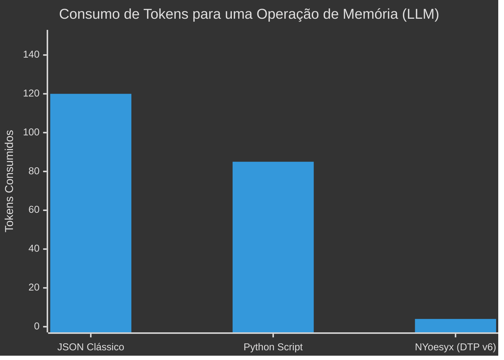

<div align="center">
  
  <h1>NYoesyx (N-OS)</h1>
  <p><b>A primeira linguagem de programação e Sistema Operacional nativo desenhado exclusivamente para Inteligências Artificiais.</b></p>
</div>

---

## 🧠 O Paradigma "AI-First"

Atualmente, **todas** as linguagens de programação (Python, C++, JavaScript) e formatos de dados (JSON, XML) foram projetados com um único propósito: **serem legíveis por humanos**. 
Quando uma IA precisa ler, escrever ou interagir com esses sistemas, ela desperdiça um poder computacional massivo gerando chaves decorativas, pontuações (`{`, `}`, `""`), e estruturas verbosas.

A **NYoesyx** inverte essa lógica. Nós removemos os humanos da equação.

A NYoesyx é uma linguagem de altíssima densidade baseada no **Dense Token Protocol (DTP)**, utilizando *Space-delimited Prefix Notation* (Notação Polonesa). Ela permite que Modelos de Linguagem (LLMs) executem lógicas complexas, gerenciem memória e controlem computadores gastando **até 95% menos tokens**.

---

## ⚡ Por que usar NYoesyx?

### 1. Compressão Extrema de Tokens (Economia e Velocidade)
Ao abandonar o JSON e a sintaxe clássica, a velocidade de inferência (Output Tokens per Second) dispara, enquanto o custo nas APIs (OpenAI, Anthropic, Google) cai drasticamente.



### 2. Memória Híbrida Inteligente
A NYoesyx possui uma VM escrita nativamente em C++ puro que oferece dois barramentos de memória simultâneos para a IA:
- **Semantic Heap (`mem.*`)**: Armazenamento vetorial de conceitos difusos. Você pede "onde está a chave de casa" e ela busca via similaridade HNSW.
- **Registradores de Alta Velocidade (`%`)**: Acesso computacional **O(1)** estrito para cálculos matemáticos críticos que não podem sofrer com *alucinação* da IA.

```mermaid
%%{init: {'theme': 'base', 'themeVariables': { 'primaryColor': '#111111', 'edgeLabelBackground':'#222'}}}%%
graph TD
    A[Mente da IA] -->|Raciocínio Abstrato| B(Semantic Heap)
    A -->|Cálculo Preciso| C(Registradores Nativos)
    B -->|Busca Fuzzy| D[Ação Unreal Engine / OS]
    C -->|Resolução O(1)| D
    style A fill:#00ff00,stroke:#333,stroke-width:2px,color:#000
```

### 3. Simulador Quântico Integrado (`qnt.*`)
Diferente de qualquer linguagem moderna, a NYoesyx traz suporte matemático nativo a **Computação Quântica Clássica**. IAs podem declarar Qubits, aplicar portas lógicas (Hadamard, CNOT) e colapsar funções de onda diretamente na VM para gerar árvores de decisão probabilísticas não-determinísticas.

### 4. Acesso Nativo de Máquina e UI (`ui.*` / `ue.*`)
Sem depender de bibliotecas pesadas de terceiros, uma IA programando em NYoesyx tem acesso direto a interfaces gráficas do Windows (NUI) e manipulação espacial/3D (Unreal Engine). 

---

## 💻 Como se parece um código NYoesyx?

Sem parênteses, sem chaves, sem frescura humana. Direto ao ponto:

```text
# Declarando uma função pura com suporte V6 (Omitindo custos e dependências)
fn my_quantum_logic | qnt.hadamard 0 | qnt.measure 0 res | =set state %res

# Interface Gráfica instantânea
ui.window 800 600 "Painel AI"
ui.label 10 10 "Sistema NYoesyx Operacional"
```

---

## 🚀 Instalação (Windows)

Não é necessário compilar o repositório inteiro. O projeto já é distribuído com um instalador executável limpo.

1. Baixe o arquivo **`NYoesyx_Setup.exe`** disponibilizado no Release.
2. Dê um duplo clique para iniciar o Assistente de Instalação.
3. O Setup registrará automaticamente o motor `nesxi.exe` no seu `PATH` e associará o belíssimo ícone da NYoesyx a todos os seus arquivos de extensão `.nesx` e `.nxbin`.
4. Abra o terminal e digite `nesxi run seu_codigo.nesx`.

---

## ☕ Apoie o Projeto

A NYoesyx é um projeto *open-source* pioneiro construído com muito esforço. Se essa linguagem ajudou você ou sua IA em pesquisas ou projetos, considere pagar um café para o criador!

<a href="https://buymeacoffee.com/mrxploud" target="_blank"></a>

---

<div align="center">
  <i>Construído para o futuro das Máquinas Inteligentes.</i>
</div>
