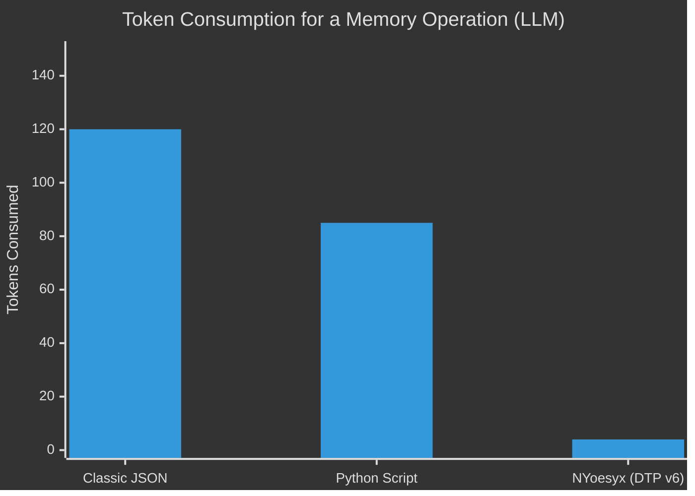

<div align="center">
  
  <h1>NYoesyx (N-OS)</h1>
  <p><b>The first AI-Native programming language and Operating System designed exclusively for Artificial Intelligence.</b></p>
  <p><a href="README-pt.md">🇧🇷 Leia em Português</a></p>
</div>

---

## 🧠 The "AI-First" Paradigm

Currently, **all** programming languages (Python, C++, JavaScript) and data formats (JSON, XML) were designed with a single purpose: **to be human-readable**. 
When an AI needs to read, write, or interact with these systems, it wastes massive computational power generating decorative keys, syntax punctuation (`{`, `}`, `""`), and verbose structures.

**NYoesyx** flips this logic upside down. We remove humans from the equation.

NYoesyx is an ultra-dense language based on the **Dense Token Protocol (DTP)**, using *Space-delimited Prefix Notation* (Polish Notation). It allows Large Language Models (LLMs) to execute complex logic, manage memory, and control computers while spending **up to 95% fewer tokens**.

---

## ⚡ Why NYoesyx?

### 1. Extreme Token Compression (Cost & Speed)
By abandoning JSON and classical syntax, the inference speed (Output Tokens per Second) skyrockets, while API costs (OpenAI, Anthropic, Google) drop drastically.



### 2. Smart Hybrid Memory
NYoesyx features a VM natively written in pure C++ that offers two simultaneous memory buses to the AI:
- **Semantic Heap (`mem.*`)**: Vector storage for fuzzy concepts. You ask "where is the house key" and it searches via HNSW similarity.
- **High-Speed Registers (`%`)**: Strict **O(1)** computational access for critical mathematical calculations that cannot afford AI *hallucinations*.

```mermaid
%%{init: {'theme': 'base', 'themeVariables': { 'primaryColor': '#111111', 'edgeLabelBackground':'#222'}}}%%
graph TD
    A[AI Mind] -->|Abstract Reasoning| B(Semantic Heap)
    A -->|Precise Calculation| C(Native Registers)
    B -->|Fuzzy Search| D[Unreal Engine / OS Action]
    C -->|O(1) Resolution| D
    style A fill:#00ff00,stroke:#333,stroke-width:2px,color:#000
```

### 3. Built-in Quantum Simulator (`qnt.*`)
Unlike any modern language, NYoesyx brings native mathematical support for **Classical Quantum Computing Simulation**. AIs can declare Qubits, apply logic gates (Hadamard, CNOT), and collapse wave functions directly in the VM to generate non-deterministic probabilistic decision trees.

### 4. Native UI & Machine Access (`ui.*` / `ue.*`)
Without relying on heavy third-party libraries, an AI coding in NYoesyx has direct access to Windows graphical interfaces (NUI) and spatial/3D manipulation (Unreal Engine). 

---

## 💻 What does NYoesyx code look like?

No parentheses, no brackets, no human syntactic sugar. Straight to the point:

```text
# Declaring a pure function with V6 support (Omitting costs and dependencies)
fn my_quantum_logic | qnt.hadamard 0 | qnt.measure 0 res | =set state %res

# Instant Graphical Interface
ui.window 800 600 "AI Dashboard"
ui.label 10 10 "NYoesyx Operating System"
```

---

## 🚀 Installation (Windows)

No need to compile the whole repository. The project is distributed with a clean executable installer.

1. Download the **`NYoesyx_Setup.exe`** file.
2. Double-click it to start the Setup Wizard.
3. The Setup will automatically register the `nesxi.exe` engine in your `PATH` and associate the beautiful NYoesyx icon with all your `.nesx` and `.nxbin` files.
4. Open the terminal and type `nesxi run your_code.nesx`.

---

## ☕ Support the Project

NYoesyx is a pioneering open-source project built with massive effort. If this language helped you or your AI in research or projects, consider supporting the creator!

<a href="https://link.mercadopago.com.br/bytemirage" target="_blank"></a>

---

<div align="center">
  <i>Built for the future of Intelligent Machines.</i>
</div>
