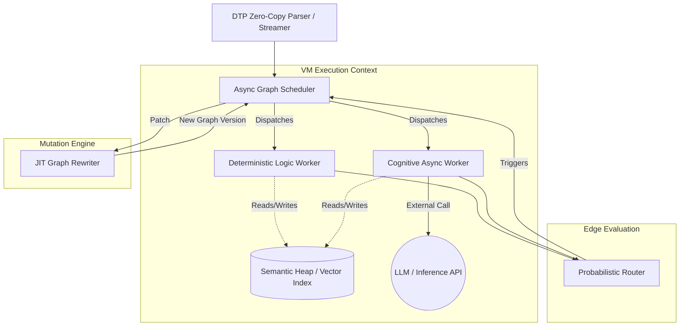

# NYoesyx VM Architecture & Execution Model

## Overview
Traditional Virtual Machines (like the JVM or V8) rely on sequential execution, stack/register-based memory, and deterministic control flow. The NYoesyx VM operates on fundamentally different principles: it evaluates a **Multi-dimensional Execution Graph** asynchronously, utilizes a **Semantic Heap** for variable resolution, and expects probabilistic, non-deterministic branches.

This document outlines the architecture for a highly concurrent, cost-aware VM designed to execute `.nesx` graphs.

## Core Architecture Components

### 1. Async Execution Engine (The Graph Scheduler)
Because native operations (like `cognitive.infer`) involve high-latency API calls to LLMs, the VM cannot block. The execution engine is built as an **Asynchronous Dataflow Scheduler**.
- **Nodes as Futures**: Every node in the `.nesx` graph is treated as a Future/Actor. 
- **Dependency Resolution**: A node remains suspended until all required `inputs` are fully resolved and their respective edge conditions are satisfied.
- **Streaming Execution**: The scheduler ingests Dense Token Protocol (DTP) streams directly from LLMs. It does not wait for a full document to parse; as soon as a complete DTP command is yielded (e.g., `Node|n_001|op:cognitive.infer`), the scheduler instantiates the Future and prepares dependency resolution.
- **Concurrency**: Fully deterministic nodes (`logic.transform`) are executed in highly parallel, lightweight threads, while cognitive nodes are batched and dispatched to async network workers.

### 2. Semantic Memory Manager (The Semantic Heap)
NYoesyx uses "Semantic Pointers" rather than hardcoded variable names.
- **Vector Space Indexing**: The heap memory includes an embedded vector database (e.g., an in-memory HNSW index).
- **Allocation & Token Optimization**: To save LLM tokens, the VM does not receive raw float arrays. Instead, the LLM outputs a semantic hint (e.g., `concept|time_since_birth`). The VM uses a fast local embedding model (like `all-MiniLM-L6-v2`) to generate the vector representation on the fly and registers it in the HNSW index alongside the value.
- **Resolution**: When a node requests "the value closest to concept X", the memory manager performs a k-Nearest Neighbors (k-NN) search against the current scope's index.
- **Caching**: Frequently queried semantic pointers are cached aggressively to minimize vector search overhead.

### 3. Cost-Aware Probabilistic Router
Branching in NYoesyx is not boolean (`true`/`false`) but probabilistic (e.g., `confidence > 0.8`).
- **Cost Weights**: The `cost_weight` property dictates whether a branch should wait for definitive certainty or run speculatively.
- **Speculative Execution**: If an unresolved edge points to a low-cost, deterministic logic node, the VM may execute it speculatively for multiple potential outcomes. If the branch resolves to a different path, the speculative results are pruned.
- **Threshold Gating**: Expensive cognitive nodes (e.g., complex multi-step reasoning) will strictly await their edge conditions to save API costs.

### 4. Graph Re-Writer (Self-Modification & Healing)
NYoesyx graphs can self-modify or self-heal when logic fails.
- **Immutable Versioned Graphs**: Mutating the graph in place during concurrent execution leads to data races. Instead, the VM treats the graph as an immutable data structure.
- **Context Swapping**: When a node issues a `graph.rewrite` instruction, it yields a patch (diff). The VM generates a new version of the graph (`Graph v+1`), maps the current execution state to the new topology, and safely swaps the execution context.

## System Architecture Diagram

## Dense Token Protocol (DTP) Ingestion
To maximize IA2IA communication efficiency and minimize token consumption, NYoesyx discards traditional formats like JSON, FlatBuffers, or MsgPack in favor of a **Dense Token Protocol (DTP)**.

- **Pipe-Delimited S-Expressions**: Data is formatted as flat, pipe-separated tokens (e.g., `Node|n_001|op:cognitive.infer|in:n_000.out`).
- **Zero-Copy Parsing**: The VM's ingest layer uses zero-copy string views (like C++ `std::string_view` or Rust `&str`) to parse the DTP stream with virtually zero heap allocation overhead.
- **Direct Memory Routing**: Tags like `Mem|` or `Ptr|` allow the parser to immediately route semantic concepts directly to the Semantic Heap allocator, bypassing heavier tree-building steps.

## The Instruction Cycle
Instead of standard `Fetch -> Decode -> Execute`, the NYoesyx VM follows:
1. **Resolve**: Check for completed inputs and update edge probabilities.
2. **Evaluate**: Determine which nodes have their dependency & probability thresholds met.
3. **Dispatch**: Send logic nodes to local threads and cognitive nodes to the async network pool (speculating on cheap nodes if probability is pending).
4. **Publish**: Node completes, pushes output + embedding to the Semantic Heap, and triggers downstream edges.
